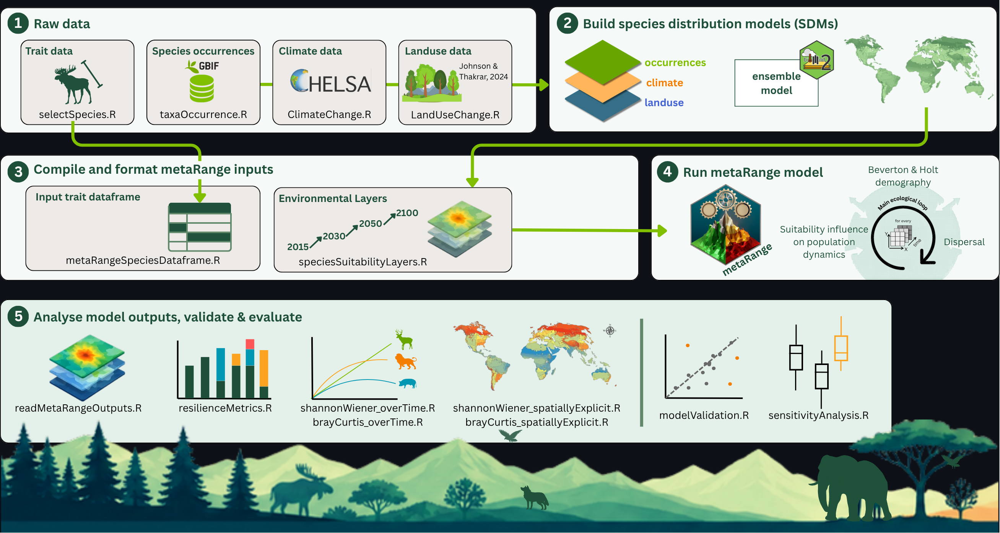

# NatPoKe — Nature Policy Effects on Keystone Species

 

A research pipeline using the [metaRange](https://metarange.github.io/metaRange/#) framework to couple species distribution models with population demography and dispersal, to quantify species resilience (invariability, resistance, recovery and persistence), temporal change in community diversity (Shannon-Wiener) and composition (Bray-Curtis dissimilarity), alongside their spatial heterogeneity.

> 🚧 **Under active development** 🚧 
>
> For questions, clarifications, or collaborations regarding this project, please contact:  **André P. Silva** & **Inês Silva**  [Institution or Department Name]  Email: [andre.pinto.da.silva@su.se](andre.pinto.da.silva@su.se) & [misilva@ciencias.ulisboa.pt](misilva@ciencias.ulisboa.pt)

## Repository Overview

This repository contains all scripts and supporting materials used in the modeling and analysis pipeline. 

| Folder | Description |
|:---|:---|
| **data** | Raw data, including trait data for 109 mammal species, sourced from the [SRIT-database](https://zenodo.org/records/18455098). Other external datasets (e.g. IUCN spatial distribution datasets) are also kept in this folder/subfolders. SDM outputs shoudl be saved here (if system's storage capcity allows it). |
| **input** | Intermediate files and data transformations used during pre-processing. ⚠️ *Currently not in use.* |
| **output** | Generated results: figures, tables, and model outputs. |
| **src** | All R scripts used in data analysis, modeling, and visualization. ➡️ For full details, see the [`src/README.md`](https://github.com/andrepsilvadev/NatPoKe/blob/ines_silva/src/README.md).  |
| **reports** | R Markdown files producing reports from model runs (single and multispecies), and main and supplementary project figures. |

 

## Scripts description  

### 1. Raw data

`selectSpecies.R`  
Selects and filters the mammal species included available from the [SRIT-database](https://zenodo.org/records/18455098) datasets, based on the necessary traits (e.g. reproduction rate, body mass, etc...)

`taxaOccurrence.R`  
Retrieves and processes species occurrence records from GBIF to generate the occurrence dataset used for species distribution modelling.

`ClimateChange.R`
Processes current and projected climate layers from CHELSA and prepares the environmental data for the different future scenarios and time periods.

`LandUseChange.R`
Processes land-use/land-cover data and generates the corresponding current and future environmental layers used in the species distribution models.

### 2. Species Distribution Models

`SDM.R`  
Builds species distribution models through [biomod2](https://biomodhub.github.io/biomod2/), using species occurrences from GBIF, together with climate and land-use as predictors, to estimate current and future species suitability ranges. A custom function is created to iterate through the whole process of building an SDM and do it across multiple species and scenarios.

`SDMfigures.R`  
Generates presence maps with used records vs total available ones, variable importance tables, evaluation metrics plots together with current and projected distribution maps for all species, commonly used for quality control and interpretation of results before moving forward.

### 3. Build metaRange inputs

`metaRangeSpeciesDataframe.R`  
Compiles and formats species traits into a metaRange ready dataframe required for all species within a region to be modelled. See more details on how to add traits to species within metaRange [here](https://metarange.github.io/vignettes/A01_intro/#adding-traits-to-species).

`speciesSuitabilityLayers.R`  
Prepares species-specific environmental suitability layers across time periods to serve as environment in the metaRange simulations. Produced SDM outputs are stacked (e.g. 2015, 2030, 2050 and 2100) and interpolation is used to fill in timesteps between years/layers (e.g. between 2030 and 2050).

### 4. Run metaRange simulations

`mammalModel.R`  
Code for the metaRange population dynamics simulations, incorporating processes like suitability influence on population parameters, demography following Beverton & Holt and dispersal to simulate mammal population dynamics under alternative scenarios. See [here](https://metarange.github.io/vignettes/A01_intro/#adding-processes) more on how to add processes in metaRange.

### 5. Analysis, validation & evaluation

`readMetaRangeOutputs.R`  
Reads and performs basic diagnostics (population trends plots, suitability over time plots, all modelled species trait dataframe) from the raw metaRange simulation outputs for downstream analyses and checkups. It also compiles multiple metaRange (e.g. different regions) runs into one single dataframe.

`modelValidation.R`  
Evaluates model performance by comparing simulated outputs against an independent dataset ([Santini et al. 2022](https://onlinelibrary.wiley.com/doi/full/10.1111/geb.13476)) to assess the reliability of model predictions.

`sensitivityAnalysis.R`  
Tests the sensitivity of model outcomes to key parameters and assumptions to identify which factors most influence the results.

`speciesResilienceMetrics.R`  
Calculates species-level resilience metrics (invariability, resistence, extent of recovery, rate of recovery, persistence), using the [estar](https://besjournals.onlinelibrary.wiley.com/doi/10.1111/2041-210x.70265) package, from the model outputs to quantify changes in population abundance to environmental change.

`shannonWiener_overTime.R`  
Calculates temporal changes in community diversity using the Shannon–Wiener diversity index.

`shannonWiener_spatiallyExplicit.R`    
Calculates spatially explicit (per cell) Shannon–Wiener diversity across the study area to identify spatial patterns in community diversity.

`brayCurtis_overTime.R`  
Quantifies temporal changes in community composition using Bray–Curtis dissimilarity.

`brayCurtis_spatiallyExplicit.R`  
Calculates spatially explicit (per cell) Bray–Curtis dissimilarity to assess spatial variation and turnover in community composition.   

 
