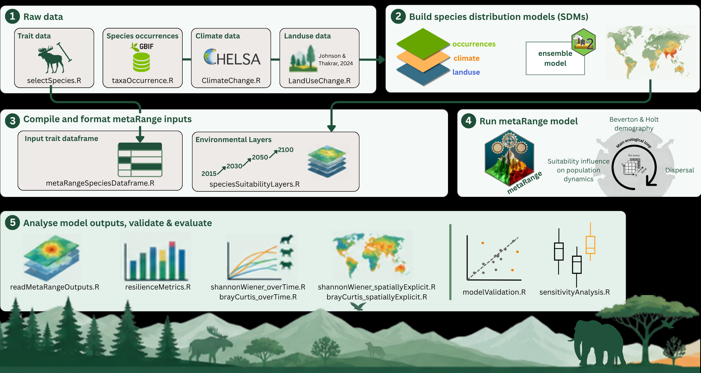

# NatPoKe — Nature Policy Effects on Keystone Species

[](https://doi.org/10.0000/placeholder) [](https://finbio.org/)

A research pipeline to explore how nature policy interventions affect keystone species in Boreal and Tropical forests.<br> The project leverages process-based modeling (via [metaRange](https://metarange.github.io/metaRange/#)) and resilience metrics to evaluate ecological responses under various policy scenarios.

> 🚧 **Under active development** 🚧<br>
>
> For questions, clarifications, or collaborations regarding this project, please contact:<br> **André P. Silva**<br> [Institution or Department Name]<br> Email: [[your.email\@example.com](mailto:your.email@example.com){.email}]

## Repository Overview



This repository contains all scripts and supporting materials used in the modeling and analysis pipeline.<br>

| Folder | Description |
|:---|:---|
| **data** | Raw data, including trait data for XX mammal species, sourced from multiple sources. |
| **input** | Intermediate files and data transformations used during pre-processing. ⚠️ *Currently not in use.* |
| **output** | Generated results: figures, tables, and model outputs. *Currently with dummy figure only.* |
| **src** | All R scripts used in data analysis, modeling, and visualization.<br>➡️ For full details, see the [`src/README.md`](https://github.com/andrepsilvadev/NatPoKe/blob/ines_silva/src/README.md).<br> |
| **reports** | R Markdown files producing reports from model runs (single and multispecies), and main and supplementary project figures. |

<br>

\## 🛠 How to Run the Pipeline - Quick Guide <br>

Use the `run.R` to run the complete pipeline from creating the inputs for a specific species, region and scenario up to running the metaRange model and producing results.

``` r
#  1️⃣ Load Settings & Libraries
source("./src/libraries.R")            # Load necessary packages
source("./src/customFunctions.R")      # Load customized functions

# Set a unique run name (e.g., date_region_scenario)
runname <- "13Sep_SouthAmerica_ssp585"

# Create folder to save pipeline inputs and outputs
source("./src/generalSettings.R")


# 2️⃣ Select Input Parameters

# Choose the target biome (select one)
target_biome <- "Boreal Forests/Taiga"  
# Options: "Tropical & Subtropical Moist Broadleaf Forests", "Boreal Forests/Taiga"

# Choose the target region (select one)
target_region <- "Europe"  
# Options: "North America", "South America", "Europe", "Asia", "Africa"

# Choose the scenario name
scenario <- "ssp126" # Options: "ssp126" or "ssp585

# Choose target species (can include multiple species and names must have spaces)
target_species <- c(
  "Alces alces",    # Moose
  "Lynx lynx"       # Eurasian lynx
)


# 3️⃣ Prepare & Load Input Data

# create species traits dataframe
source("./src/mammalMetaRangeSpeciesDataframe.R")

# build Species Distribution Models & save output rasters
#source("./src/SDM.R") - this script should be run separetly & at the moment outputs from this script exist for 16 species

## transform SDM outputs into input data for MetaRange model
source("./src/specieSuitabilityLayers.R")

# 4️⃣ Run the Mammal Model

source("./src/mammalModel.R")
```
